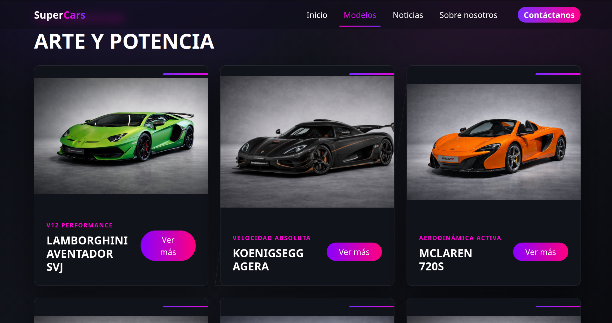
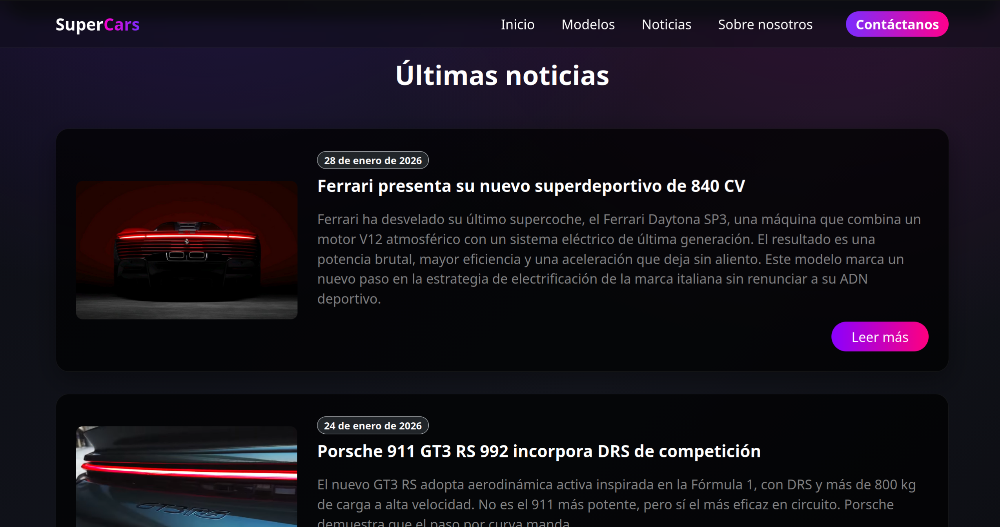
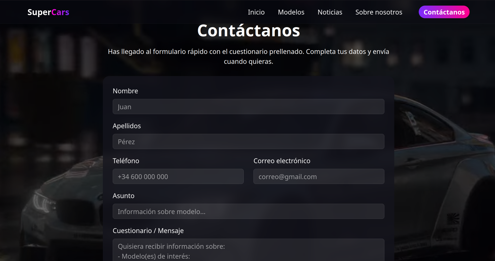

# 🚗 SuperCarsWeb


Modern web application developed with **Angular 19** that showcases a collection of luxury and super sports cars. The application features a responsive design, reusable components, dynamic navigation and an automotive news section, providing an engaging browsing experience.

> 🎓 Developed as part of the Higher Vocational Training in Web Application Development (DAW).

---

# ✨ Features

- 🏠 Responsive home page
- 🚗 Supercars catalogue
- 📰 Automotive news section
- 📄 News detail pages
- 📞 Contact page
- ℹ️ About us page
- ❌ Custom 404 page
- 🔀 Angular Routing
- 🧩 Reusable components
- 📱 Responsive design
- 📋 Form handling

---

# 📸 Screenshots

## 🚗 Supercars Catalogue



## 📰 News



## 📞 Contact



---

# 🛠️ Technologies

- Angular 19
- TypeScript
- HTML5
- CSS3
- Bootstrap 5
- Angular Router
- Angular Forms
- Express (Angular SSR)

---

# 📂 Project Structure

```text
src/
│
├── componentes/
│   ├── navbar/
│   ├── footer/
│   ├── sobre-nosotros/
│   └── not-found/
│
├── paginas/
│   ├── home/
│   ├── modelos/
│   ├── noticias/
│   ├── noticia-detalle/
│   └── contacto/
│
├── servicios/
│
└── interfaces/
```

---

# 🚀 Installation

Clone the repository

```bash
git clone https://github.com/EloyRomero19/SuperCarsWeb.git
```

Install dependencies

```bash
npm install
```

Run the development server

```bash
ng serve
```

Open your browser at:

```
http://localhost:4200
```

---

# 📚 What I Learned

During the development of this project I strengthened my knowledge of:

- Angular component architecture
- TypeScript
- Routing and navigation
- Reusable components
- Responsive web design
- Bootstrap integration
- Frontend project organization
- Modern web application development

---

# 👨‍💻 Author

**Eloy Romero**

Junior Software Developer

GitHub: https://github.com/EloyRomero19